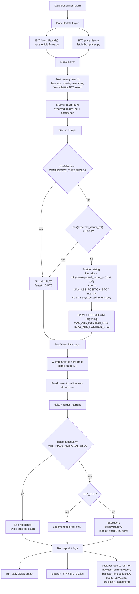

# Strategy Process Diagram (Detailed)

## Decision Logic Reference

- Forecast inputs: `expected_return_pct`, `confidence`.
- Trade decision:
  - `flat` if confidence is below threshold.
  - `flat` if absolute expected return is too small.
  - otherwise long/short by sign of expected return.
- Position sizing:
  - scales with forecast magnitude up to max position cap.
- Portfolio management:
  - hard cap on absolute BTC exposure,
  - minimum notional gate to avoid low-value churn,
  - 1x leverage intent for low-risk directional exposure.
