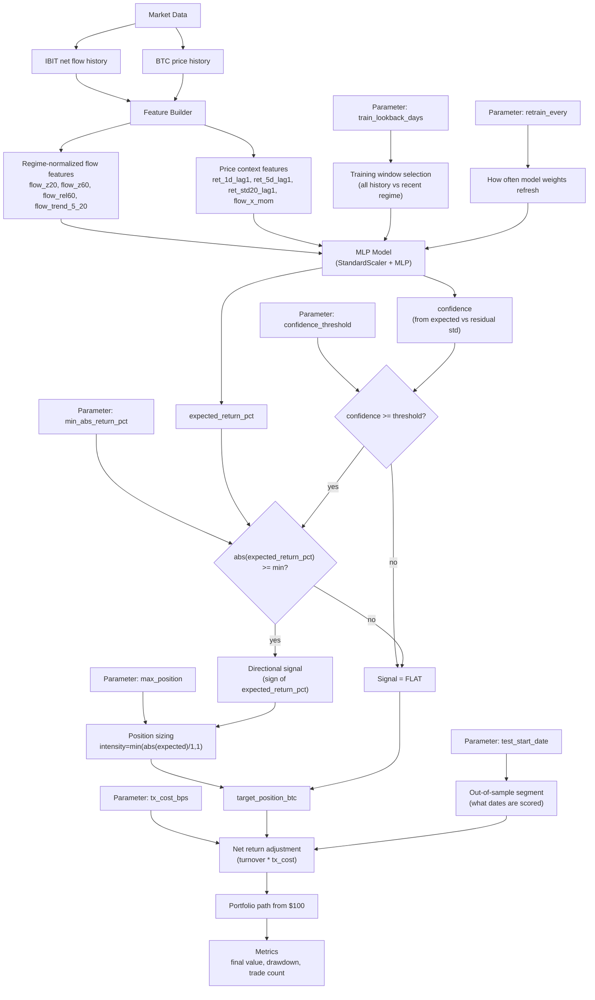

# Variant Parameter Impact Flow

## Parameter-to-decision mapping

- `confidence_threshold` and `min_abs_return_pct` directly gate whether the strategy is flat or active.
- `max_position` changes trade size, not direction.
- `train_lookback_days` and `retrain_every` influence model outputs (`expected_return_pct`, `confidence`) by changing what data the model learns from and how quickly it adapts.
- `tx_cost_bps` does not change signal direction, but it changes net PnL and can flip a profitable gross strategy to unprofitable net.
- `test_start_date` defines the out-of-sample evaluation regime.
